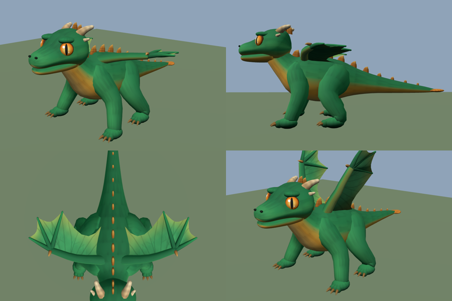

# Dragon Whelp — procedural rigged GLB

`build_dragon_whelp.py` generates `dragon_whelp.glb`: a small stylized emerald
dragon whelp, rigged and animated, ready to drop into Unity, Godot, Unreal,
Three.js/Babylon or any glTF 2.0 pipeline for mobile.



```bash
pip install -r requirements.txt
python build_dragon_whelp.py                       # -> dragon_whelp.glb (+ dragon_whelp_albedo.png)
python build_dragon_whelp.py -o hero.glb --texture-size 1024
```

## The model

| | |
|---|---|
| Pose | Neutral, symmetrical rest/bind pose: four legs in a wide A-pose, wings spread horizontally, head forward & level, tail straight back, feet flat on y = 0, no base |
| Look | Stubby rounded body, oversized head, big slit-pupil eyes, short blunt horns, small ridged spine plates, wings shorter than the body. Emerald scales, amber underbelly, bronze claws |
| Axes / units | Y-up, facing +Z, metres (≈1.1 m wingspan, 1.55 m nose-to-tail, 0.73 m tall) |
| Mesh | 1 mesh, 1 primitive, 1 material → **1 draw call**; ~11.2k tris / ~7k verts; 16-bit indices |
| Skinning | 35 joints, ≤ 4 influences per vertex, weights normalised |
| Material | PBR metallic-roughness (metallic 0, roughness 0.82). `baseColorTexture` (hand-painted atlas, 512² PNG, sRGB) × `COLOR_0` (painted tint + baked top-light/contact shading) |
| Animations | `Idle` (3 s loop), `Walk` (1 s loop, diagonal gait), `Flap` (0.6 s loop), `Roar` (1.6 s one-shot) |
| Validation | Khronos glTF-Validator: 0 errors, 0 warnings, 0 hints |

### Skeleton

```
root
└─ hips
   ├─ spine ─ chest
   │          ├─ neck ─ neck2 ─ head ─ jaw
   │          ├─ upperarm.L/R ─ forearm.L/R ─ hand.L/R
   │          └─ wing1.L/R ─ wing2.L/R ─ finger1/2/3.L/R
   ├─ tail1 ─ tail2 ─ tail3 ─ tail4 ─ tail5
   └─ thigh.L/R ─ shin.L/R ─ foot.L/R
```

Joints carry translation only (identity rest rotations), so local rotation
axes equal world axes in the bind pose: X = pitch, Y = yaw, Z = roll.
`.L` is the dragon's left (+X).

### Texture atlas (`dragon_whelp_albedo.png`)

| UV region | Content |
|---|---|
| u 0–1, v 0–0.5 | Overlapping scales, tiles horizontally (all skin lofts) |
| u 0–0.25, v 0.5–0.75 | Amber eye with slit pupil and highlights |
| u 0–0.25, v 0.75–1 | Banded strokes for horns, claws and plates |
| u 0.25–1, v 0.5–1 | Wing membrane mottling and veins |

The texture is mostly a value/detail map; hue comes from `COLOR_0`, so
recolouring the whelp (e.g. a ruby or sapphire variant) is a palette change
at the top of the script.

## How it is built

Everything is plain numpy:

* **Lofts** (ellipse swept along a Catmull-Rom path with parallel-transport
  frames) for torso/neck/tail, head, jaw, legs, wing arms, fingers, horns,
  claws and spine plates.
* **Ellipsoids** for eyes, brows, paws (flattened at y = 0) and toes.
* **Wing membranes**: panels fanned from the wrist between finger struts, with
  a scalloped trailing edge and slight billow, double-sided with real geometry
  (no `doubleSided` material needed).
* **Skin weights**: inverse-distance (⁴) to each candidate bone segment,
  top 4 kept; small rigid parts (claws, horns, eyes, jaw…) bind to one bone.
* **GLB writer**: hand-rolled, embeds the PNG, inverse bind matrices and
  sampled (30 fps, linear) animation clips.

## Engine notes

* **Unity**: import the `.glb` with glTFast or UnityGLTF. Set the rig to
  *Generic*; clips import by name. Use a shader that multiplies vertex colour
  (glTFast's default does).
* **Godot 4**: drag in; clips appear on the `AnimationPlayer`.
* **Blender**: *File → Import → glTF 2.0*; set *Bone Dir* to "Temporary" for
  nicer bone display.
* For an unlit / toon look, the baked vertex shading already reads well with
  `KHR_materials_unlit` or an unlit shader.
